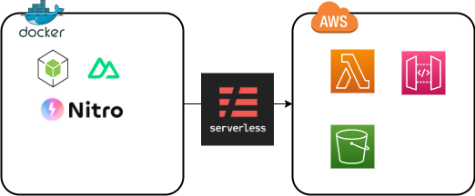

# このgitリポジトリについて
nuxt3を用いてwebアプリケーションを構築してサーバーレスデプロイするためのベースとするもの

## 基本方針


- コンテナ環境において開発作業する
    - SPA構成を取りSSRしない
    - Nitroでbuildする
- slsを用いてサーバーレスデプロイできる
    - aws lambdaで関数URL化する
    - api gatewayにエンドポイントを立ててアクセスできる
- その他、開発に有用なツールをいくつか積んでおくこと

## 初回起動
```
git clone https://github.com/ShunsukeNONOMURA/nuxt3-master.git
cd nuxt3-master
./shells/bash.sh
yarn install
```

## ディレクトリ構成
components
composables
layouts
middleware
pages
server

plugins

## よく使う コマンド チートシート
### host環境
docker compose run --rm nuxt bash
git secrets --scan
git add .
git commit -m 'comment'
git push

### コンテナ環境
yarn install
yarn add -D {libname}
yarn remove {libname}
yarn dev
yarn nuxi typecheck
yarn build
yarn generate
yarn sls plugin install
yarn sls invoke local
yarn sls deploy
yarn sls deploy list
yarn sls remove


## ガイド
[Nuxt3 Guide](https://nuxt.com/docs/guide)
[Vite ガイド](https://ja.vitejs.dev/guide/)
[Nitro Getting Started](https://nitro.unjs.io/guide/getting-started)
[Serverless Framework Documentation](https://www.serverless.com/framework/docs)