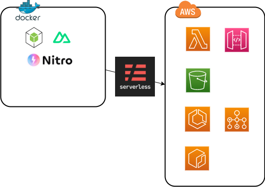

# このgitリポジトリについて
nuxt3を用いてwebアプリケーションを構築してサーバーレスデプロイするためのベースとするもの

## 基本方針


- コンテナ環境において開発作業する
    - SPA構成を取りSSRしない
    - Nitroでbuildする
- slsを用いてサーバーレスデプロイできる
    - aws lambdaで関数URL化する
    - api gatewayにエンドポイントを立ててアクセスできる
- その他、開発に有用なツールをいくつか積んでおくこと

## 初回起動
```
git clone https://github.com/ShunsukeNONOMURA/nuxt3-master.git
cd nuxt3-master
./shells/bash.sh
yarn install
```

## 主要な導入ソフトウェア
| ライブラリ | 用途                             |
| ---------- | -------------------------------- |
| docker     | コンテナによる仮想環境           |
| serverless | サーバーレス環境へのホスティング |
| aws cli    | awsコマンド操作                  |
| nuxt3      | フルスタックwebフレームワーク    |
| vuetify    | マテリアルデザインコンポーネント |
| i18n       | 多言語対応                       |
| pug        | テンプレートエンジン             |
| typescript | 静的型付け                       |
| prisma     | orm                              |
| eslint     | 静的解析ツール                   |
| prettier   | フォーマッター                   |
| vitest     | テスト                           |

## ディレクトリ構成
components
composables
layouts
middleware
pages
server

tests

plugins
prisma

## よく使うコマンドチートシート
### host環境
| コマンド                          | 動作 |
| --------------------------------- | ---- |
| docker compose run --rm nuxt bash |      |
| git secrets --scan                |      |
| git status -uall                  |      |
| git add .                         |      |
| git commit -m 'comment'           |      |
| git push                          |      |

### コンテナ環境
| コマンド                            | 動作                                      |
| ----------------------------------- | ----------------------------------------- |
| yarn install                        | package.jsonのライブラリをinstall         |
| yarn add -D {libname}               | ライブラリを開発環境に追加                |
| yarn remove {libname}               | ライブラリを削除                          |
| yarn prisma format                  | .prismaファイルの整形                     |
| yarn prisma migrate reset           | **取り扱い注意：RDB初期化（警告は出る）** |
| yarn prisma migrate dev --name init |                                           |
| yarn prisma generate                | typeとer図生成                            |
| yarn prisma studio                  |                                           |
| yarn dev                            | nuxt開発環境立ち上げ                      |
| yarn nuxi typecheck                 |                                           |
| yarn vitest                         | test実行                                  |
| yarn vitest run --coverage          | test実行（カバレッジ出力）                |
| yarn build                          | ビルド実行                                |
| yarn generate                       |                                           |
| yarn sls plugin install             | slsのプラグインinstall                    |
| yarn sls invoke local               | slsのlocal実行                            |
| yarn sls deploy                     |                                           |
| yarn sls deploy list                |                                           |
| yarn sls remove                     |                                           |


## ガイド
[Nuxt3 Guide](https://nuxt.com/docs/guide)
[Vite ガイド](https://ja.vitejs.dev/guide/)
[Nitro Getting Started](https://nitro.unjs.io/guide/getting-started)
[Serverless Framework Documentation](https://www.serverless.com/framework/docs)

## サーバーサイドJavascriptのメリット・デメリット
- Webフロントエンドの知識や実装をバックエンドに応用しやすい
    - 歴史的経緯からWebフロントエンドでは結局javascriptの知識が求められる
    - 別言語でバックエンド書くと学習時間が分散してしまうので学習コストの削減をしたい
    - typescriptで作成したデータ型等を流用したい
    - 命名規則を統一できる
        - RDB間はprismaを使うとマッピングで対応できる
- 他言語独自のライブラリが使えない
    - とはいえ、大抵のライブラリはjsに揃っているはず
    - [ORM：prisma](https://www.prisma.io/)
    - [検索エンジン：opensearch](https://www.npmjs.com/package/@opensearch-project/opensearch)
    - [AWS:AWS SDK for JavaScript](https://aws.amazon.com/jp/sdk-for-javascript/)
    - [LLM：langchain](https://js.langchain.com/docs/get_started/installation)
    - [機械学習：PyTorch](https://pytorch.org/docs/stable/jit.html)
