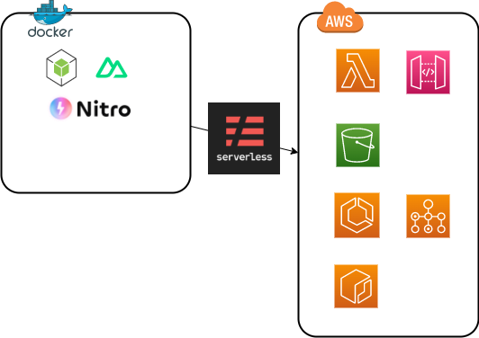

# このgitリポジトリについて
nuxt3を用いてwebアプリケーションを構築してサーバーレスデプロイするためのベースとするもの

## 基本方針


- コンテナ環境において開発作業する
    - SPA構成を取りSSRしない
    - Nitroでbuildする
- slsを用いてサーバーレスデプロイできる
    - aws lambdaで関数URL化する
    - api gatewayにエンドポイントを立ててアクセスできる
- その他、開発に有用なツールをいくつか積んでおくこと

## 初回起動
```
git clone https://github.com/ShunsukeNONOMURA/nuxt3-master.git
cd nuxt3-master
./shells/bash.sh
yarn install
```

## 主要な導入ソフトウェア
| ライブラリ | 用途                             |
| ---------- | -------------------------------- |
| docker     | コンテナによる仮想環境           |
| serverless | サーバーレス環境へのホスティング |
| aws cli    | awsコマンド操作                  |
| nuxt3      | フルスタックwebフレームワーク    |
| vuetify    | マテリアルデザインコンポーネント |
| i18n       | 多言語対応                       |
| pug        | テンプレートエンジン             |
| typescript | 静的型付け                       |
| prisma     | orm                              |
| eslint     | 静的解析ツール                   |
| prettier   | フォーマッター                   |
| vitest     | テスト                           |

## ディレクトリ構成
components
composables
layouts
middleware
pages
server

tests

plugins
prisma

