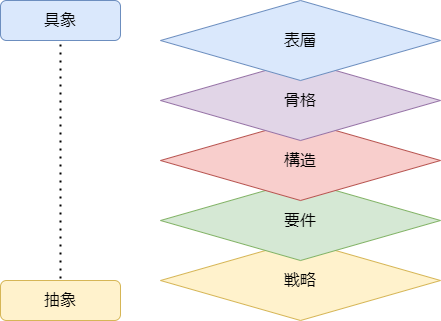

# （記述中）戦略：UX設計戦略

## UX5段階モデル

| 段階 | 成果物             |
| ---- | ------------------ |
| 表層 | ビジュアルデザイン |
| 骨格 | レイアウトデザイン |
| 構造 | モデリング         |
| 要件 | 要件定義           |
| 戦略 | 目的設定、目標設定 |

下段に当たる部分についての作業がおろそかになる場合、上段の作業に影響が出る。

UXデザイナー
UIデザイナーの役割は、〈構造〉〈骨格〉〈表層〉段階の設計
IAデザイナー

## ソフトウェア
UX
脳内モデル
GUI
表現モデル（表層設計UI、構造設計IA）
System
実装モデル

OOUI

UIモデリング
UIクラス図（ユーザがUIで触れるオブジェクト）

## ビジュアルデザイン
マテリアルデザイン

## 参考
- [UIデザインにおけるインターフェイスアーキテクトの役割](https://goodpatch.com/blog/ui-interface-architect)
- [UIデザイナーのスキルとOOUI観点の構造設計](https://goodpatch.com/blog/uidesigner-skill-ooui-structure)

- [デジタル庁：デザインシステム](https://www.digital.go.jp/policies/servicedesign/designsystem)
- [Figma vs. XD: 比較したらFigmaが最強だと判明した](https://zenn.dev/z_ypi/articles/7c2818391cf71c)
- [Official Vuetify 3 UI Kit Figma](https://store.vuetifyjs.com/products/vuetify-ui-kit-figma)
    - Vuetify 3のコンポーネント

- [Making sense of MVP](https://blog.crisp.se/2016/01/25/henrikkniberg/making-sense-of-mvp)

## UXD（顧客体験設計）

## UID（画面設計）
画面遷移

## Intaraction Design

<!-- <-- ------------------------ -->

# UXの5段階モデル (Five Elements of UX Design)

抽象度が高く、
具象度が高い

UX（User Experience）の要素を5つの段階に分類したもの

UX（User Experience）とは、「ユーザーがプロダクトを利用した際に得られる体験・感情全て」のこと

例
- メッセージアプリで友人に連絡する
- スタンプを購入する
- 恋人からの返信がなかなか来なくてイライラする

『Elements of User Experience』では、戦略～表層の段階を踏んでいくことをプロダクト開発のガイドラインとしています

抽象的な概念である戦略を土台として、徐々に具体的な段階に移っていくことで、プロダクトの目的から外れることなく開発を進めることができる

## 戦略（Strategy）
ユーザーニーズとプロダクト目的の設定

## 要件（Scope）
ユーザーにとって必要なコンテンツ・機能の設計

### コンテンツ要件
### 機能要件

## 構造（Structure）
ユーザーが欲しい情報や使いたい機能にたどり着くための全体構造設計

### 情報設計
### インタラクションデザイン

## 骨格（Skeleton）
ユーザーが理解しやすいインターフェース上の情報設計

## 表層層（Surface）
ユーザーが視覚的に認識するデザイン
### ビジュアルデザイン

## ツール一覧

## 参考
- [UXデザインの5段階モデルとは？ビジネスにおける必要性から具体的な進め方まで詳しく解説！](https://blog.nijibox.jp/article/5elements_of_ux/)
- [デザイン思考とアジャイルの組み合わせが生むDXの進化](https://bluelogic.jp/design/designagile/)

プロトタイピング