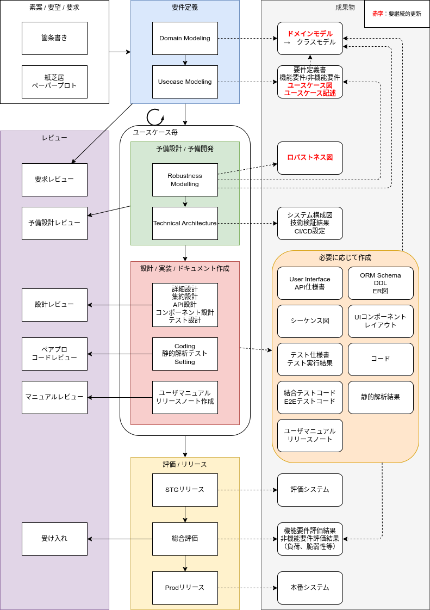

# 戦略：Agile ICONIX
ここでは主にAgile ICONIXの開発戦略ついて記述する。  
設計などの開発戦術までは踏み込まない。  

## Agile ICONIX
アジャイル開発とICONIXの中間のような手法。  
要求（requests）から要件（requirements）を明らかにしてから開発をアジャイルに進める形。  
予備設計（ロバストネス分析）までをICONIXのように反復的に行い、以降のフローはアジャイル開発で進める流れをとる。  

- ICONIXの思想を継承してユースケース駆動開発に持ち込める
- 顧客のオーナーシップが弱く開発が丸投げ気味だとしても、ロバストネス解析の範囲までで要求定義をカバーできる
- 最小限のドキュメント作成にとどめ、アジャイル開発を進めるのでICONIXよりはスピード感を出せる
    - コードからドキュメンテーションに持ち込める領域を増やせるとアジャイル感出てくる
- 詳細設計まで踏み込まないので開発側で開発戦術の統一が取れていないと実装の一貫性が破綻する
    - それなりには設計統制がプログラマに求められる。能力不足なら素直に設計するしかないか？
    - ダメエンジニアいらない論
        - [参考：ソフトウェア開発プロセス残酷物語](https://blog.jnito.com/entry/2012/08/26/181015)

### Agile ICONIX 全体像

- ドメインモデルは要求定義の時点では不完全な前提。後続プロセスで修正される。最終的に用語集としての役割を担う
- 事前設計と設計方針から開発にそのまま入れる開発メンバーで構成されている必要がある（詳細設計が必要なメンバーは足を引っ張る）
- コーディングから半自動的にドキュメンテーションが行えるような手段は有用なので積極的に検討する

<!-- ### Agile ICONIX 各工程の概要
書きたくなったら書く -->

### 参考：アジャイル開発
大きな単位でシステムを区切ることなく、小単位で実装とテストを繰り返して開発を進めていく手法。  
従来の開発手法に比べて開発期間が短縮されることからアジャイル（素早い）と呼ばれる。  
チームとしてのアジャイルへの理解度、顧客側の介入度、開発側へスキルセットなど要求レベルが高く、なんちゃってアジャイルになりがちでスケールも難しい。  

- アジャイルソフトウェア開発宣言で重要視する価値観
    - プロセスやツールよりも**個人と対話**を
    - 包括的なドキュメントよりも**動くソフトウェア**を
    - 契約交渉よりも**顧客との協調**を
    - 計画に従うことよりも**変化への対応**を
- フィットする前提条件
    - 継続的リリースが必要
    - 要求変化への対応が必要
    - 抽象的な要求について開発メンバーがカバーできる
    - **チームが**継続的かつ**自己組織的**にプロセスを改善できる
    - 顧客が**開発を丸投げせず**、オーナーシップを発揮できる
- デメリット
    - スケジュールのコントロールが難しい
        - アジャイル開発の経験があるプロジェクトマネージャーを中心に綿密に計画を立てたうえで導入するのが望ましい
    - 顧客とのコミュニケーションを重視する特性が裏目に出る
        - なかなか正しい要求が導き出せないままプロジェクトが進行してしまう
        - 場当たり的な開発に陥って開発の方向性がブレてしまう
    - 実装重視なのでドキュメントが必要最低限になる。ドキュメント至上主義の場合フィットしにくい。

### 参考：ICONIX
ICONIX（アイコニクス）とは最小限のUMLを用いる、ユースケースを中心とした設計で、保守性が高く要求を満たすコードを実現する開発プロセスのこと。  
ITプロジェクトが失敗する80%は要件分析・要件定義が不適切・不十分であったために発生すると言われているため、要件分析・要件定義フェーズにフォーカスするICONIXはプロジェクトの成功において有用である。  

- アジャイルとウォータフォールの中間ぐらい
    - 前フェーズへの手戻りを許容している（≠ウォーターフォール）。
    - 詳細設計まで行うので実装を軸に置いてない（≠アジャイル）。

### 参考：開発方式比較表
| 開発方式           | 特徴                               | 設計コスト | 実装抽象度、自己組織化要求度 | スケジュールコントロール難易度 |
| ------------------ | ---------------------------------- | ---------- | ---------------------------- | ------------------------------ |
| ウォーターフォール | 前段階に戻ってはいけない           | 大         | 小                           | 低                             |
| ICONIX             | 詳細設計までを反復的に行う         | 大〜中     | 小                           | 中                             |
| Agile ICONIX       | ロバストネス分析までを反復的に行う | 中         | 中                           | 中〜高                         |
| アジャイル         | 実装を軸にプロジェクト進行         | 小         | 大                           | 高                             |

## 用語
- ユーザーストーリー
    - 「ユーザーが実現したいこと」「ユーザーにとって価値があること」
- イテレーション / スプリント
    - 短期間で反復しながら効率的に開発を進めるアジャイル開発の1サイクルを単位にしたもの
- ストーリーポイント
    - ユーザーストーリー（要求）の規模を示す数値
- ベロシティ
    - 開発チームが1回のイテレーション内に完了できたストーリーポイントの合計値
- リリース計画
    - いつまでにどの機能をリリースできるか
    - プロジェクトのゴール
    - イテレーションの長さ
    - ユーザーストーリーの優先順位

## 参考
- アジャイル開発
    - [アジャイルソフトウェア開発宣言](https://agilemanifesto.org/iso/ja/manifesto.html)
    - [アジャイル開発とは？　特徴とメリット・デメリット、スクラムまで徹底解説](https://monstar-lab.com/dx/solution/about-agile_methods/)
- ICONIX
    - [ユースケース駆動開発実践ガイドのまとめ 〜ICONIXプロセスとはなんなのか〜](https://zenn.dev/tomoeine/articles/2babb554aa0478)
    - [DDD時代に考えたいICONIXプロセス](https://logmi.jp/tech/articles/323010)
    - [ユースケース駆動開発実践ガイドを参考にシューティングゲーム作成](https://qiita.com/nannany_stores/items/59ae11a333e91a2a1cfb)
    - [「ユースケース駆動開発実践ガイド」（2007年, 翔泳社） ](https://www.amazon.co.jp/%E3%83%A6%E3%83%BC%E3%82%B9%E3%82%B1%E3%83%BC%E3%82%B9%E9%A7%86%E5%8B%95%E9%96%8B%E7%99%BA%E5%AE%9F%E8%B7%B5%E3%82%AC%E3%82%A4%E3%83%89-OOP-Foundations-%E3%83%80%E3%82%B0%E3%83%BB%E3%83%AD%E3%83%BC%E3%82%BC%E3%83%B3%E3%83%90%E3%83%BC%E3%82%B0/dp/4798114456)
- Agile ICONIX
    - [明日から使えるDDDのためのユースケース駆動開発（ICONIXプロセス）](https://qiita.com/hirodragon/items/e2330edc1d1a329d17f5)
    - [DDDとICONIXとアジャイルを複合したシステム開発構想](https://github.com/JORI-RT/SystemDevelopmentMethod?tab=readme-ov-file)
- その他
    - [プログラムコード至上主義](https://iwatam-server.sakura.ne.jp/software/devintro/art/x30.html)
