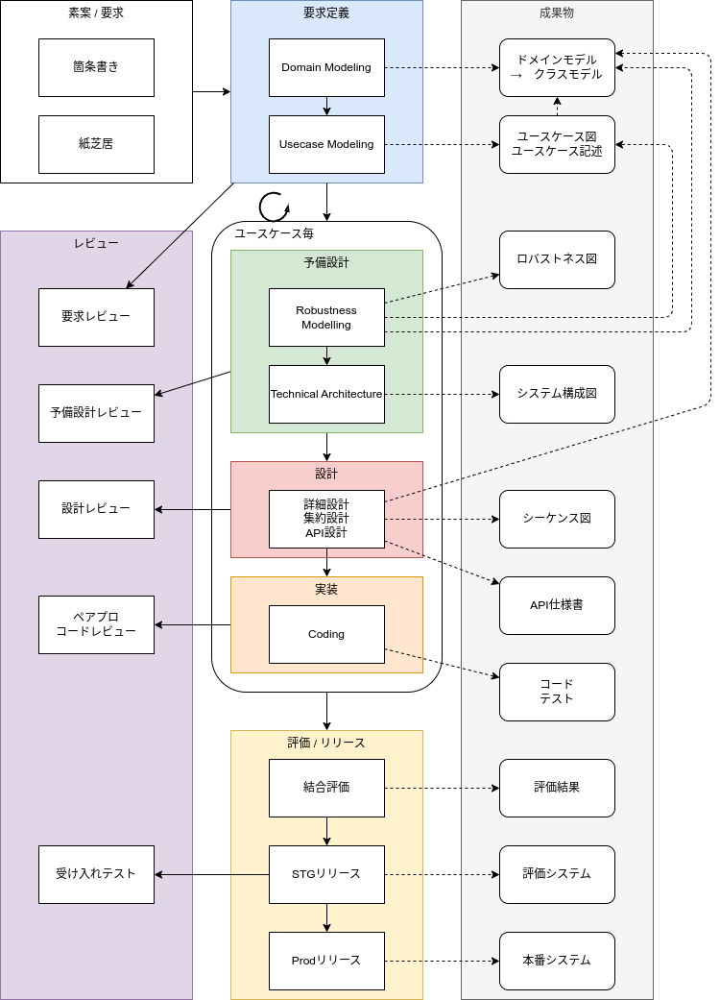

# ICONIX
ICONIX（アイコニクス）とは最小限のUMLを用いる、ユースケースを中心とした設計で、保守性が高く要求を満たすコードを実現する開発プロセスのこと。  
ITプロジェクトが失敗する80%は要件分析・要件定義が不適切・不十分であったために発生すると言われているため、要件分析・要件定義フェーズにフォーカスするICONIXはプロジェクトの成功において有用である。

- アジャイルとウォータフォールの中間ぐらい
    - 前フェーズへの手戻りを許容している（≠ウォーターフォール）。
    - 実装を軸に置いてない（≠アジャイル）。

アジャイルソフトウェア開発宣言

計画→設計→実装→テストといった開発工程を機能単位の小さいサイクルで繰り返すのが最大の特徴

重要視する価値観

- プロセスやツールよりも**個人と対話**を
- 包括的なドキュメントよりも**動くソフトウェア**を
- 契約交渉よりも**顧客との協調**を
- 計画に従うことよりも**変化への対応**を

フィットする前提条件

- 継続的リリースが必要
- 要求変化への対応が必要
- **開発を丸投げせず**、顧客がオーナーシップを発揮できる
- **チームが**継続的かつ**自己組織的**にプロセスを改善する

デメリット
- スケジュールのコントロールが難しい
    - アジャイル開発の経験があるプロジェクトマネージャーを中心に綿密に計画を立てたうえで導入するべき
- 顧客とのコミュニケーションを重視する特性が裏目に出る
    - なかなか正しい要求が導き出せないままプロジェクトが進行してしまう
    - 場当たり的な開発に陥って開発の方向性がブレてしまう

用語
- ユーザーストーリー
    - 「ユーザーが実現したいこと」「ユーザーにとって価値があること」
- イテレーション / スプリント
    - 短期間で反復しながら効率的に開発を進めるアジャイル開発の1サイクルを単位にしたもの
- ベロシティ
    - 開発チームが1回のイテレーション内に完了できたユーザーストーリー（要求）の規模の合計値
- リリース計画
    - いつまでにどの機能をリリースできるか
    - プロジェクトのゴール
    - イテレーションの長さ
    - ユーザーストーリーの優先順位

- [アジャイルソフトウェア開発宣言](https://agilemanifesto.org/iso/ja/manifesto.html)
- [アジャイル開発とは？　特徴とメリット・デメリット、スクラムまで徹底解説](https://monstar-lab.com/dx/solution/about-agile_methods/)

## 開発戦略全体像（ICONIX + Ajile）

ドメインモデルは要求定義の時点では不完全な前提。後続プロセスで修正される。

## ロバストネス図
| 要素         | 概要                                                 |
| ------------ | ---------------------------------------------------- |
| バウンダリ   | アクターが相互作用する画面やボタン                   |
| エンティティ | ソフトウェアシステム内部で半永久的に管理するデータ   |
| コントロール | バウンダリとエンティティをつないでシステムが行う処理 |

## 参考
- [ユースケース駆動開発実践ガイドのまとめ 〜ICONIXプロセスとはなんなのか〜](https://zenn.dev/tomoeine/articles/2babb554aa0478)
- [DDD時代に考えたいICONIXプロセス](https://logmi.jp/tech/articles/323010)
- [「ユースケース駆動開発実践ガイド」（2007年, 翔泳社） ](https://www.amazon.co.jp/%E3%83%A6%E3%83%BC%E3%82%B9%E3%82%B1%E3%83%BC%E3%82%B9%E9%A7%86%E5%8B%95%E9%96%8B%E7%99%BA%E5%AE%9F%E8%B7%B5%E3%82%AC%E3%82%A4%E3%83%89-OOP-Foundations-%E3%83%80%E3%82%B0%E3%83%BB%E3%83%AD%E3%83%BC%E3%82%BC%E3%83%B3%E3%83%90%E3%83%BC%E3%82%B0/dp/4798114456)
- [明日から使えるDDDのためのユースケース駆動開発（ICONIXプロセス）](https://qiita.com/hirodragon/items/e2330edc1d1a329d17f5)
- [DDDとICONIXとアジャイルを複合したシステム開発構想](https://github.com/JORI-RT/SystemDevelopmentMethod?tab=readme-ov-file)