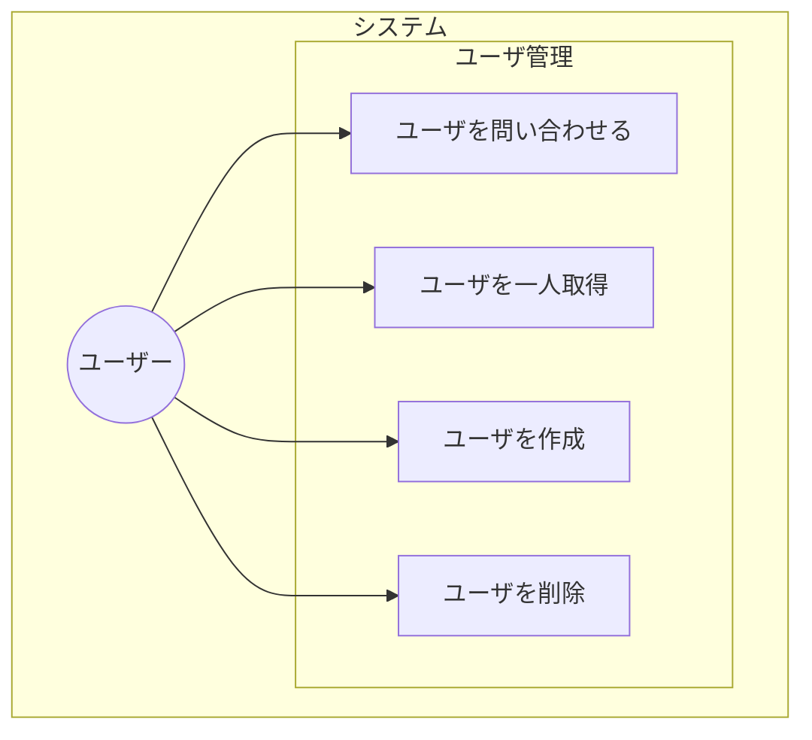
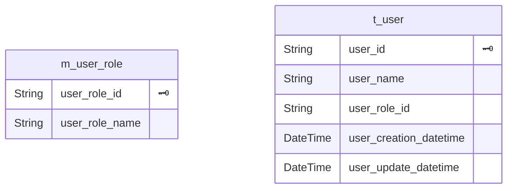
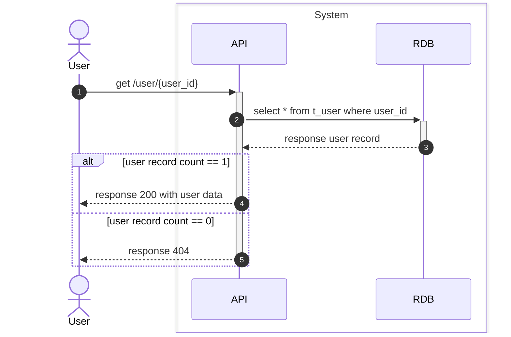

# デザイン

## UXD（顧客体験設計）

### ユースケース図

```mermaid
graph TB
    subgraph "システム"
        User((ユーザー))
        subgraph "ユーザ管理"
            QueryUser[ユーザを問い合わせる]
            GetUser[ユーザを一人取得]
            CreateUser[ユーザを作成]
            DeleteUser[ユーザを削除]
        end
    end
    User --> QueryUser
    User --> GetUser
    User --> CreateUser
    User --> DeleteUser
```

### ユースケース記述

## IAD（情報設計）

### ER図
prisma-erd-generator で生成

```mermaid
erDiagram

  "m_user_role" {
    String user_role_id "🗝️"
    String user_role_name 
    }
  

  "t_user" {
    String user_id "🗝️"
    String user_name 
    String user_role_id 
    DateTime user_creation_datetime 
    DateTime user_update_datetime 
    }
  
```

## UID（画面設計）
画面遷移

## Intaraction Design

### シーケンス図

```mermaid
%% Settings
sequenceDiagram
autonumber

%% Node
actor user as User
box System
participant api as API
participant rdb as RDB
end

%% Sequence
user->>+api: get /user/{user_id}
api->>+rdb: select * from t_user where user_id
rdb-->>-api: response user record
alt user record count == 1
    api-->>user: response 200 with user data
else user record count == 0
    api-->>-user: response 404
end
```