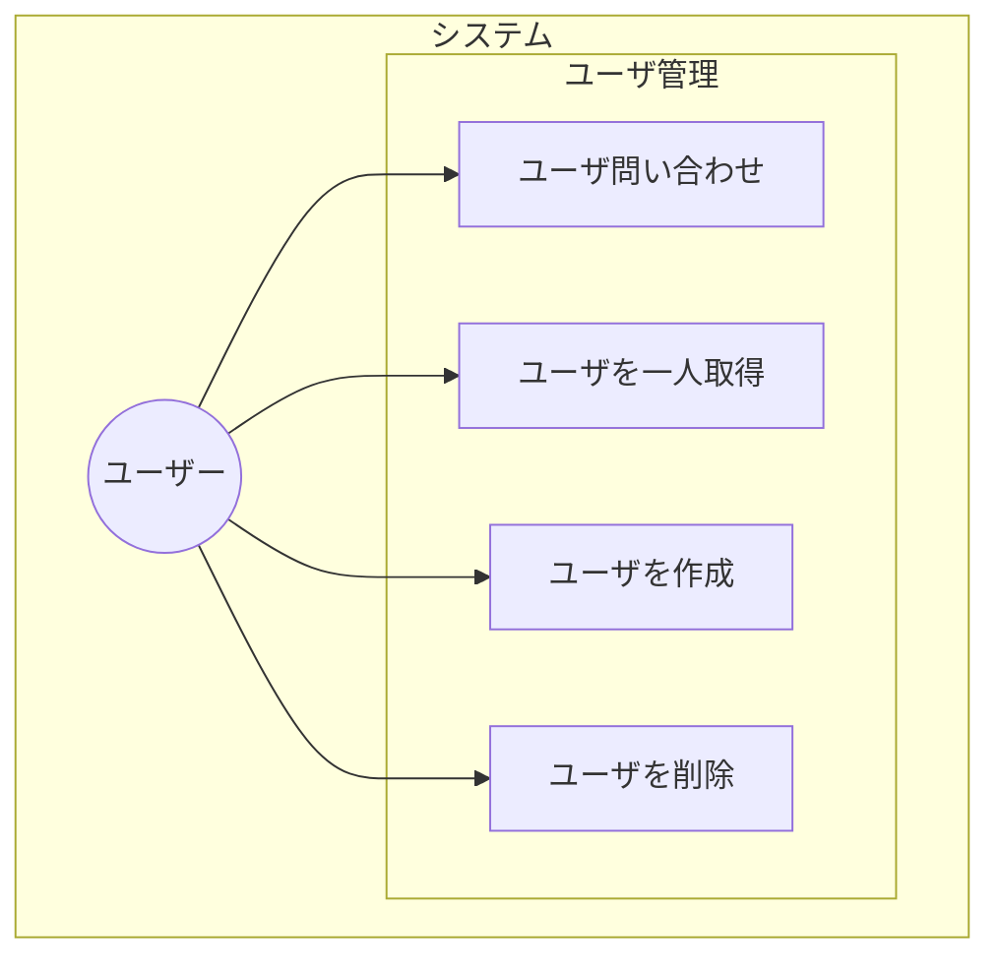

# API設計

## html status code

4xx Client Error
5xx Server Error

| HTTPステータスコード | 説明 |
| - | - |
| 400 Bad Request | 一般的なクライアントエラー |
| 401 Unauthorized | アクセス権が無い、または認証に失敗 |
| 403 Forbidden | 閲覧権限が無い |
| 404 Not Found | 見つからない |
| 500 Internal Server Error | 何らかのサーバ内で起きたエラー |

## Usecase

## ER図