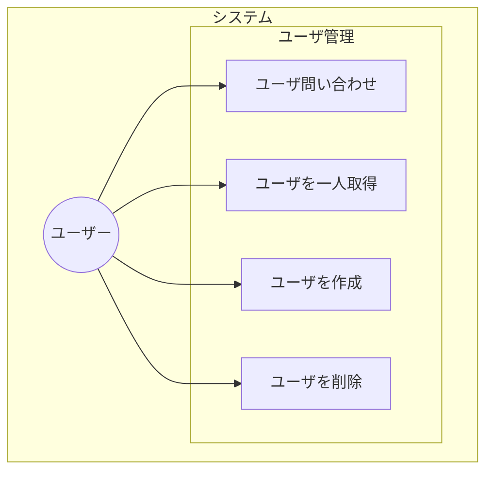
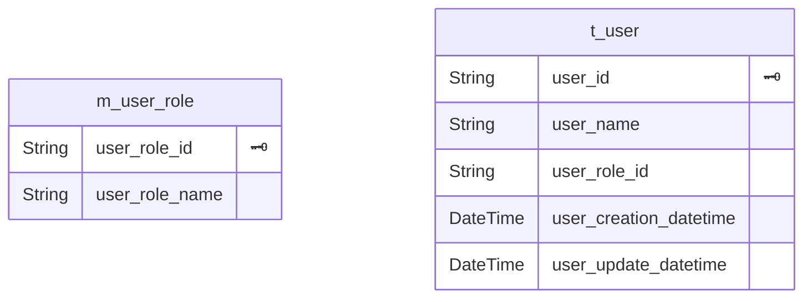

# API設計

## API Code

## html status code

4xx Client Error
5xx Server Error

| HTTPステータスコード | 説明 |
| - | - |
| 400 Bad Request | 一般的なクライアントエラー |
| 401 Unauthorized | アクセス権が無い、または認証に失敗 |
| 403 Forbidden | 閲覧権限が無い |
| 404 Not Found | 見つからない |
| 500 Internal Server Error | 何らかのサーバ内で起きたエラー |

## Usecase

## ER図
prisma-erd-generator で生成

## サーバーサイドJavascriptのメリット・デメリット
- フロントエンドの知識や実装を応用しやすい
  - 歴史経緯からフロントエンドではjavascriptの利用が求められる
  - もともとPythonでバックエンド書いているが、堅牢なコードを書こうとするほど学習時間が分散してしまうので、学習コストを削減したい。
- Python独自のライブラリが使えない
  - とはいえ、大抵のライブラリは揃っているはず
  - [ORM：prisma](https://www.prisma.io/)
  - [検索エンジン：opensearch](https://www.npmjs.com/package/@opensearch-project/opensearch)
  - [機械学習：PyTorch](https://pytorch.org/docs/stable/jit.html)
  - [LLM：langchain](https://js.langchain.com/docs/get_started/installation)