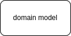
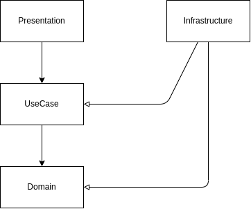

# DDD + CQRS

DDD(Domain Driven Design)とはドメインモデルを中心としたソフトウェア設計手法のことである。  
いくつか派生があるが、概ね下記のような特徴がある。

- モデル、サービス、アプリケーション、プレゼンテーションのような層を持つ構造であること
    - 派生により常にこの4層構造での名称ではないことに注意
- 外側から内側に向けた一方通行の依存関係になっている
    - プレゼン -> アプリ -> サービス -> モデル
- DIP:Dependency Inversion Principle
    - 原典のレイヤードアーキテクチャではDIPを使うことを提示していない

本実装では制約のバランスが良いオニオンアーキテクチャを採用する。  
また、更新系についてDDDはよく機能するが、参照系に対して実装に悩む場面が多い。  
そこで、CQRS(コマンドクエリ責務分離)を用いて参照系の実装の仕組みと分離することとした。  

## オニオンアーキテクチャ
DDDの派生の中でオニオンアーキテクチャを利用するものとする。

- presentation
- usecase
- domain
    - domain service
    - domain model
- infrastructure

## CQRS
CQRSは「情報の参照に使用するモデルと更新に使用するモデルに異なるものを使用する」アーキテクチャを指す。

