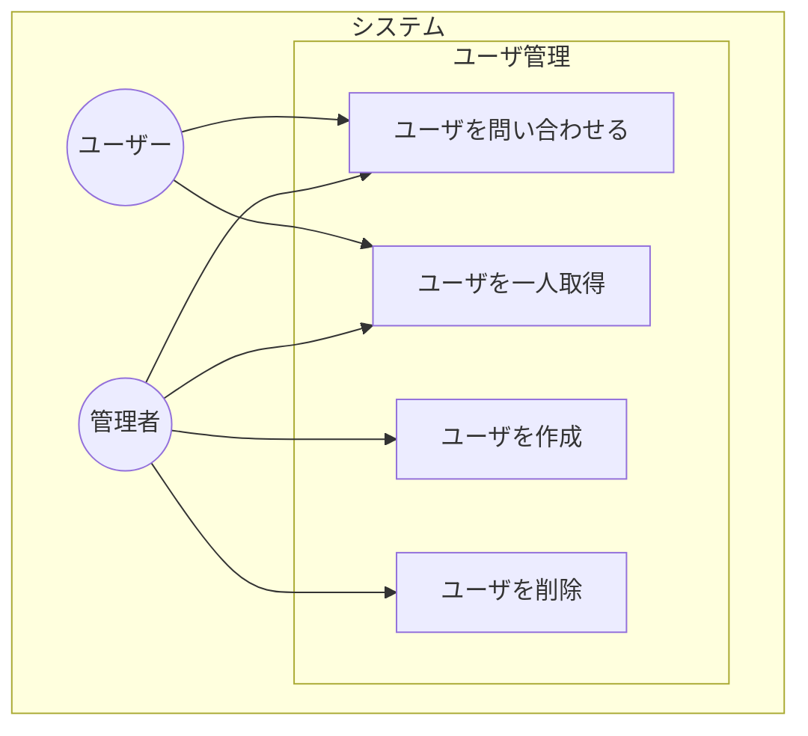

# （記述中）要件定義：ユースケース

## ユースケース図

## ユースケース記述
| 項目             | 概要 |
| ---------------- | ---- |
| ユースケース名   |      |
| 概要             |      |
| アクター         |      |
| 事前条件         |      |
| 事後条件         |      |
| 基本フロー       |      |
| 代替フロー       |      |
| 例外フロー       |      |
| サブユースケース |      |
| 備考             |      |

## 参考
- [若手エンジニア必読！超絶分かるユースケース図－全知識と書き方５ステップ](https://it-koala.com/usecasediagrams-1832)

<!-- ---------------------------- -->

## ユースケース
アクター(actor)とシステムのやりとりを示すもの

- [ユースケース図とは？事例から学べる初心者向け書き方ガイド](https://www.lucidchart.com/pages/ja/uml-use-case-diagram)

