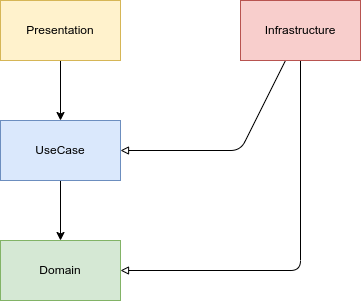

# （途中）DDD + CQRS
DDD(Domain Driven Design)とは**ドメインモデル**を中心としたソフトウェア設計手法のことである。  
いくつか派生があるが、概ね下記のような特徴がある。

- モデル、サービス、アプリケーション、プレゼンテーションのような層を持つ構造であること
    - 派生により常にこの4層構造での名称ではないことに注意
- 外側から内側に向けた一方通行の依存関係になっている
    - プレゼン -> アプリ -> サービス -> モデル
- DIP:Dependency Inversion Principle
    - 原典のレイヤードアーキテクチャではDIPを使うことを提示していない

本実装のバックエンドでは制約のバランスが良いオニオンアーキテクチャを採用する。  
また、更新系についてDDDはよく機能するが、参照系に対して実装に悩む場面が多い。  
そこで、CQRS(コマンドクエリ責務分離)を用いて参照系の実装の仕組みと分離することとした。  

## オニオンアーキテクチャ
DDDの派生の中でオニオンアーキテクチャを利用するものとする。  
よく円形の図が用いられており、その見た目からオニオンアーキテクチャと呼ばれている模様。

- Presentation
    - エンドポイント提供
    - Http Requestで渡された値とUseCaseに渡す値のマッピング
- UseCase
    - ユースケースの実現
    - Presentationで利用するDataTransferObjectの定義
    - Value Object, Entityの生成、仕様、永続化の依頼
- Domain
    - RepositoryのInterface
    - Value Object, Entity, Domain Serviceの定義
- Infrastructure
    - RepositoryのImplement
    - ORMの定義

## CQRS（command query responsibility segregation）
CQRSは**情報の参照に使用するモデルと更新に使用するモデルに異なるものを使用する**アーキテクチャを指す。

[参考：DDDで設計するならCQRSの利用を検討すべき](https://qiita.com/ledmonster/items/22b00c65208dffeff7e4)

```mermaid
graph LR
    Actor
    Create
    Read
    Update
    Delete

    Actor --> Create
    Actor --> Read
    Actor --> Update
    Actor --> Delete
```

CURDにおいて、Readについては複雑さの方向性が異なり、DDDの文脈で取り扱うのが困難な場合がある。

そこで、データに対する操作をCommand（命令）とQuery（問い合わせ）に分けて考える。

- Commandではトランザクショナルな書き込みや複雑な権限の整合性を担保
- Queryでは条件や出力方式の複雑さに対応
    - 検索条件
    - ページネーション
    - ソートなど前提条件

```mermaid
graph LR
    Actor
    subgraph "Command"
        Create
        Update
        Delete
    end

    subgraph "Query"
        Read
    end

    Actor --> Create
    Actor --> Read
    Actor --> Update
    Actor --> Delete
```

| 性質    | 整合性 | 書き込み | 網羅性 | 自由な検索 | 結合 |
| ------- | ------ | -------- | ------ | ---------- | ---- |
| Command | o      | o        | o      | x          | x    |
| Query   | x      | x        | x      | o          | o    |

このような設計思想はCQRS（command query responsibility segregation）と呼ばれている。

RDB内でクエリ処理を完結させるほか、RDBと検索エンジンの間で非同期にデータ同期を行い、利用シーンに応じて使い分けるような使い方もある。

```mermaid
graph LR
    Actor

    subgraph "User Interface"
        subgraph "Command"
            Create
            Update
            Delete
        end

        subgraph "Query"
            Read
        end
    end

    subgraph "Infrastructure"
        RDB
        SearchEngine
    end

    subgraph "Service"
        SyncProceccer
    end

    Query --> RDB
    Query --> SearchEngine
    
    Command --> RDB
    Command -->|1. event| SyncProceccer
    SyncProceccer -->|2. fetch records| RDB
    SyncProceccer -->|3. upsert index| SearchEngine

    Actor --> Create
    Actor --> Read
    Actor --> Update
    Actor --> Delete

    
```

また、Queryにおいてはバックエンドindexへの入出力は素直に露出させると使いやすい。

## DDD と CQRS の併用
以上を踏まえて、DDD＋CQRSの全体構造を示す。  
CommandとQueryを完全に分ける意図で下記は明示的に分割した。

- DTO
    - Command DTO
    - Query DTO
- Domain Model
    - Write Model
    - Read Model

