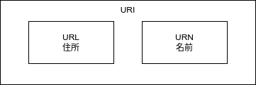

# （記述中）設計：API設計
API設計に関してまとめる。  
WebAPI設計に絶対解はないが、ベタープラクティスや周辺知識を抑えておくことに越したことはない。  
整理しつつ設計例を示してみる。  

## REST API
REpresentational State Transferの略。  
標準化ではなくあくまで設計思想。  

- Representational →具象化された
- State →状態の
- Transfer →転送

### RESTの4原則
HTTPを設計した中心人物であるRoy Fielding氏が2000年に提唱した「RESTの4原則」というものがあり、これを満たすものを「RESTfulなシステム」と呼んだりする。  

- 統一インターフェース（The Uniform Interface）
    - HTTPメソッドでJSON形式であるなど
- アドレス可能性（Addressability）
    - URIでリソース情報を表現する
- 接続性（Links and Connectedness）
    - 情報にはハイパーリンクを含めることができる
    - 情報Aが持つ情報Bの詳細についてリンクからたどれる
- ステートレス性（Statelessness）
    - セッション管理しない (Cookie等)

## html status code

| コード系 | 種類          |
| -------- | ------------- |
| 100系    | Informational |
| 200系    | Successful    |
| 300系    | Redirection   |
| 400系    | Client Error  |
| 500系    | Server Error  |


| HTTPステータスコード      | 説明                               |
| ------------------------- | ---------------------------------- |
| 400 Bad Request           | 一般的なクライアントエラー         |
| 401 Unauthorized          | アクセス権が無い、または認証に失敗 |
| 403 Forbidden             | 閲覧権限が無い                     |
| 404 Not Found             | 見つからない                       |
| 500 Internal Server Error | 何らかのサーバ内で起きたエラー     |


## URI (Uniformed Resource Identifier)
Web上のファイルがどの位置にあるのかを表したもの。  
近い概念にURL（Uniform Resource Locator）やURN（Uniform Resource Name）があるが、URIはこれらの総称に当たる。



URIの設計は覚えやすく、どんな機能を持つURIなのかがひと目でわかるルールに統一されていることが望ましい。  

- 短くて入力しやすい
    - 長い場合、不要な情報があったり、重複するものがあったりするかも
- 名詞を用いる。動詞は使わない。
- リソース名はケバブケース
    - URL中のパスパラメータ・リソース ID部分は キャメルケース
- バージョン番号が含まれている
    - hostname/api/{version}/collection
    - 破壊的更新の場合に別パスにする用途 (v1.0.1, v1.1.0 -> v1)
    - マイナーバージョン以下は更新されても互換性を保つ仮定なので省略
- サーバーアーキテクチャが反映されていない
    - cgi-bin などがパスに含まれる
    - 攻撃リスクにつながる
- リソース名はSingleton か Collection かで単数形 / 複数形を使い分ける
- クエリやタスクについては後述するAPIアクションを参照

### 考察：リソースは単数 or 複数どっち
- 賛否両論。複数派が情勢が強いかな。
- 単数派
    - ORMやEntity名との命名整合や不規則変化系への対応がシンプルになる
        - media, medium
- 複数派
    - Rest に乗っ取ると複数形
- 今の所、基本的には複数形を用いて、必要に応じて単数形で示す派
    - Singleton か Collection なのかが明示的に示せる
        - [参考：Ruby on Rails](https://api.rubyonrails.org/classes/ActionDispatch/Routing/Mapper/Resources.html)
    - プレゼンテーションで抽象的に取り扱うものだからORMやEntityと合わせなくても良い
    - 不規則変化系は英語が悪いのだが、自然言語は不完全なものであるので仕方なし
    - [KISSの原則だとどちらでも良い。一貫性が重要。](https://ja.wikipedia.org/wiki/KISS%E3%81%AE%E5%8E%9F%E5%89%87)


### パスの例

| URI                     | 説明                                   |
| ----------------------- | -------------------------------------- |
| /resource               | 特定のリソース                         |
| /resource/{id}          | 特定のリソースの中の一つ               |
| /resource/{id}/resource | 特定のリソースの中の一つが持つリソース |

## API Action
API Actionはおおむね次の８種類に分類。必要に応じて拡張する。

| action-code | action-name | 説明                                                               | 安全性 | 冪等性 | HTTP Method | 備考                               |
| ----------- | ----------- | ------------------------------------------------------------------ | ------ | ------ | ----------- | ---------------------------------- |
| 0           | Get         | 単一のリソースを取得する操作。                                     | あり   | 要     | GET         |                                    |
| 1           | List        | 全リソースを絞り込まずに一覧する操作。ページングは動作想定。       | あり   | 要     | GET         |                                    |
| 2           | Create      | リソースを新規に作成する操作。                                     | なし   | 要     | POST        |                                    |
| 3           | Patch       | 既存リソースを部分的に変更する操作。                               | なし   | 不要   | PATCH       | ユーザの名前だけを更新するなど。   |
| 4           | Upsert      | リソース置換、既存リソースがなければ作成する操作。                 | なし   | 要     | PUT         | 名前を変えたユーザを更新するなど。 |
| 5           | Delete      | リソースを削除する操作。                                           | なし   | 要     | DELETE      |                                    |
| 6           | Task        | その他、上記に分類できない複雑な更新や計算などの操作。             | なし   | 不要   | POST        | バッチ処理要求など                 |
| 7           | Query       | 特定の問い合わせ処理を要求する。検索結果などをレスポンスに含める。 | あり   | 要     | POST        | CQRSのQuery部                      |

- 安全性：リソースの状態を変化させない読み取り専用であること
- 冪等性：ある操作を1回行っても複数回行っても結果(状態)が同じになる性質

### /users/query としない
- users has a query に見える
- HTTP Method /(クエリ)/(リソース)

## レスポンス構造
- headとdataに分ける。  
- headはデバッグ的情報で内容固定
- dataは副作用的情報でAPI毎に構造を変える
    - 実はdataはdatumの複数形。data objectに有象無象を抱えているイメージで捉える。

```JSON
{
    "head": {
        "actionCode": "ARRREEE",
        "actionName": "ActionResouce"
    },
    "data": {
    }
}
```

## API設計
これまでの情報を踏まえ、APIを設計していく。

アクション名は左から　操作、リソース、（追加事項）のような構成。

### API設計サンプル

#### リソース
| リソースコード | リソース    | 説明               |
| -------------- | ----------- | ------------------ |
| 000            | Health      | システムのヘルス   |
| 100            | User        | ユーザ             |
| 200            | Chat        | チャット           |
| 201            | ChatMessage | チャットメッセージ |

#### URI
| APIアクションコード（ARRR） | APIアクション     | HTTP Method | URI                            | 操作                   |
| --------------------------- | ----------------- | ----------- | ------------------------------ | ---------------------- |
| 0000                        | GetHealth         | GET         | /health                        | ヘルス取得             |
| 0100                        | GetUser           | GET         | /users/{userId}                | ユーザ取得             |
| 2100                        | CreateUser        | POST        | /users                         | ユーザ作成             |
| 5100                        | DeleteUser        | DELETE      | /users/{userId}                | ユーザ削除             |
| 7100                        | QueryUser         | POST        | /query/users                   | ユーザ検索             |
| 0200                        | GetChat           | GET         | /chats/{chatId}                | チャット取得           |
| 2200                        | CreateChat        | POST        | /chats                         | チャット作成           |
| 5200                        | DeleteChat        | DELETE      | /chats/{chatId}                | チャット削除           |
| 7200                        | QueryChat         | POST        | /query/chats                   | チャット検索           |
| 2201                        | CreateChatMessage | POST        | /chat-messages                 | チャットメッセージ作成 |
| 3201                        | PatchChatMessage  | PATCH       | /chat-messages/{chatMessageId} | チャットメッセージ更新 |
| 5201                        | DeleteChatMessage | DELETE      | /chat-messages/{chatMessageId} | チャットメッセージ削除 |
| 7201                        | QueryChatMessage  | POST        | /query/chat-messages           | チャットメッセージ検索 |

## 参考
- [HTTP メソッドに関する API 操作の定義](https://learn.microsoft.com/ja-jp/azure/architecture/best-practices/api-design#define-api-operations-in-terms-of-http-methods)
- [翻訳: WebAPI 設計のベストプラクティス](https://qiita.com/mserizawa/items/b833e407d89abd21ee72)
- [HTTPステータス コード (HTTP status codes)](https://so-zou.jp/software/tech/network/tech/http/status-code/)
- [REST API URI Naming Conventions and Best Practices](https://restfulapi.net/resource-naming/)
- API設計
    - [Developers.IO 2018 で「API 設計」の話をしてきた #cmdevio2018](https://dev.classmethod.jp/articles/cmdevio2018-api/)
    - [REST API設計について整理してみた](https://blog.pepese.com/design-rest-api/)
    - [API設計まとめ](https://qiita.com/KNR109/items/d3b6aa8803c62238d990)
- REST API リファレンス サンプル
    - [Spotify](https://developer.spotify.com/documentation/web-api)
    - [Twitter](https://developer.twitter.com/en/docs/twitter-api/migrate/twitter-api-endpoint-map)
    - [youtube data api](https://developers.google.com/youtube/v3/docs?hl=ja)

<!-- ---------------------------------------- -->
# 途中　＃＃＃＃＃＃＃＃＃＃＃＃＃＃＃＃＃＃＃＃＃＃＃＃＃＃＃＃＃＃＃＃＃＃＃＃＃＃＃＃＃＃＃＃＃＃＃＃＃＃＃＃＃＃＃

## ドメインモデル設計サンプル

chatRoom

Chat id　チャットルーム
ChatName 主題

Join ChatMessage チャットメッセージ
Join ChatUsers　参加者

ChatRoomParticipant 参加者
ChatId チャット
ChatUserId チャット参加ユーザId

chat message id
ChatMessage
ChatMessageUserId
ChatMessageCreatedAt

**まだ**

## Process
ProcessCode = ARRR
ProcessName = ResouceNameActionName

## Recouse
3桁のコードで示すこと

## 設計のステップ
1. データの洗い出し
1. データをリソースに分割
1. リソースにURIを割り当てる
1. リソースにIFを割り当てる
1. クライアントに送受信するメディアタイプを決める
1. 接続性を高める
1. 正常系を考える
1. 例外処理を考える

<!-- <-------------------------------------------->

