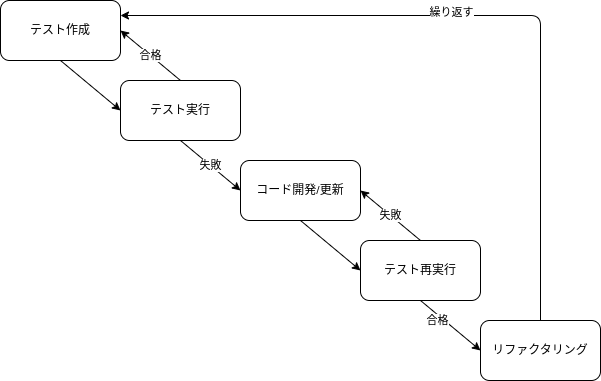

# （記述中）設計：テスト設計

- 静的解析テスト
- 単体テスト
- 結合テスト
- e2eテスト
- 負荷テスト

コスト配分

テストによる品質担保とスピードのトレードオフ

- 継続的な更新を行うアプリケーションの場合に変更による不具合発生が検知できるので更新のスピードを出せるはず
- テスト実装で時間がかかるのはテスト粒度設計の問題と考える
    - 静的解析は早めに入れておいて損はない
        - 後から入れると修正対応で地獄
    - 結合テストをメインに据えるとコスト対効果でバランスの良い
        - [The Testing Trophy](https://kentcdodds.com/blog/write-tests)
        - ユーザから見えるものにテストの比重を置く
        - False Negative 実装の詳細をテストに書くべきではない
        - False Positive 壊れるべきときに壊れない

## ##############################
- テスト駆動開発(Test-Driven Development: TDD)
- ビヘイビア駆動開発 (Behavior Driven Development: BDD)

## Test-Driven Development: TDD



1. テストの作成
    - コードを書く前に、ソフトウェアの各ユースケースとユーザーストーリーを考案する（ユースケース駆動に対するテストを考える）。
    - その後、ユースケースとユーザーストーリーからテストを作成する。
    - テストはできるだけ簡潔にする。
1. テストの実行
    <!-- - テストが実行できるようにコンパイルされます。 -->
    - この時点ではコードがまだ開発されていないため、最初のテストは失敗する。
1. テストケースに基づいてコード開発/更新
    - 期待値通りコードが正しく動けばOK。
    - ハードコードについては、ステップ⑤でリファクタリングされるので後段対応でも良い。
1. テストの再実行
    - テストが失敗した場合、コードを修正する。
    - 全てのテストに合格するまで、テストは再実行される。
1. コードのリファクタリング
    - テストが正常に実行されたら、全体的なパフォーマンスを向上させるために、コードの保守性と可読性を最適化する。
    - リファクタリングがプログラムの外部動作に影響を与えないことを確認する。

新しい機能が追加された時にテストケースを追加するために、上記のステップ1〜5の上のサイクルを繰り返す。

## Behavior Driven Development: BDD
TDDではテストの作成にあたり、次の課題に開発者は直面する。

- どこから始めるか
- 何をテストするのか
- 何をテストしないのか

BDDではステムの予想される動作を確認するためのテストに重点を置く。
BDDでは開発者やドメインの専門家以外の人でも読める「Gherkin」などの自然言語でテストケースを作成することが一般的。

### Gherkin記述例
```yaml
feature: きゅうりを食べる
  # description
  人がきゅうりを食べるときの振る舞い
  scenario: 数十本のきゅうりを食べるとお腹が満たさせる
    given: 太郎は空腹である
    when: 太郎はきゅうりを50本食べる
    then: 太郎は満腹になる
```

- [Gherkin記法はじめました](https://zenn.dev/jyoppomu/articles/4bd0ddfc75545b)

ユースケースに対して素直にテストを記述できるのでユースケース駆動との相性が良さそう。
性質上結合テストに軸を置くことになるので、The Testing Trophyの観点でもコスト対効果でバランスが良い。

<!-- #################################### -->

## 静的解析テスト
### ESLint

## 結合テスト
### vitest

## 負荷テスト

## 参考
- アジャイルテスト
    - [アジャイル開発における「TDD」と「BDD」](https://shiftasia.com/ja/column/%E3%82%A2%E3%82%B8%E3%83%A3%E3%82%A4%E3%83%AB%E9%96%8B%E7%99%BA%E3%81%AB%E3%81%8A%E3%81%91%E3%82%8Btdd%E3%81%A8bdd/)
    - [BDD - Test Driven Development](https://www.tutorialspoint.com/behavior_driven_development/behavior_test_driven_development.htm)
    - [フロントエンドにおける テスト方針〜Testing Trophyの概念とBDD〜](https://speakerdeck.com/yajihum/hurontoendoniokeru-tesutofang-zhen-testing-trophynogai-nian-tobdd?slide=13)
- フロントエンド
    - [フロントエンドのテスト戦略について考える](https://zenn.dev/koki_tech/articles/a96e58695540a7#%F0%9F%91%BD-%E3%83%95%E3%83%AD%E3%83%B3%E3%83%88%E3%82%A8%E3%83%B3%E3%83%89%E3%81%AE%E3%83%86%E3%82%B9%E3%83%88%E3%81%AE%E7%A8%AE%E9%A1%9E)
    - [Nuxt(SPAモード)の自動テストを考える](https://zenn.dev/kakkoyakakko/articles/a5ab80d0341a47)