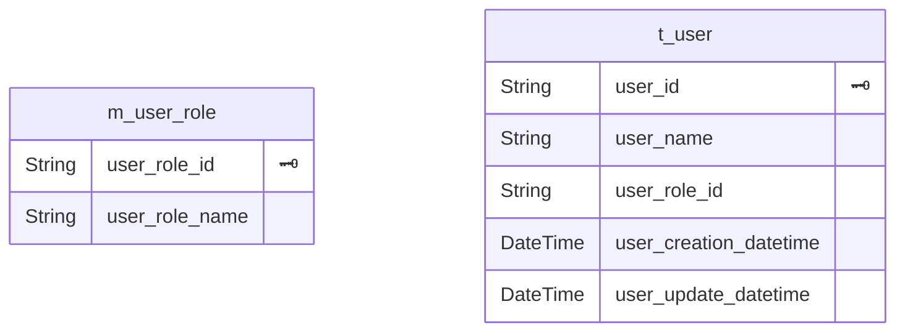

# （記述中）設計：RDB設計
RDB設計についての勘所についてまとめるページ

## [メモ]残りまとめたいもの
- data type
- リレーション設計
- 設計サンプル（カラム名予約、n:n設計）
- SQLアンチパターン

## リレーション
- 1:1
- 1:n
- n:n


- t_{table1}_{table2}

### 参考：
- [やさしい図解で学ぶ　中間テーブル　多対多　概念編](https://qiita.com/ramuneru/items/db43589551dd0c00fef9)

## 規約例
設計時に利用されている規約についていくつか提示する。
公式に決まっているものではないので、人によって採用基準が異なる。

### 構造規約
- 基本的に第三正規系以上の正規系
- 正しくリレーションを張ること。静的解析ツールとの連携に優位。

### 命名規約
- 日本語の排除
    - 文字コードによるリスク排除
- ローマ字(ヘボン式)の利用可否
    - 基本的には不要にできる
- 大文字、小文字の統一
- 単数形、複数形の統一
- 複数単語命名規則の統一
    - スネークケースが多い
        - PostgreSQLはケースインセンシティブ
- 略称利用ルール設定
    - 略称多用は可読性に悪影響
- テーブル名の役割プレフィックス
    - 用途説明とドメインモデルの名称と強く区別するために記述
    - 例
        - m:マスタ
        - t:トランザクション 
        - h:ヒストリ 
        - v:ビュー 
        - mv:マテビュー
- テーブル名の役割サフィックス
    - テーブル間の関係性を記述
    - 例
        - map:中間テーブル
- カラム名のプレフィックスに（テーブル名の役割プレフィックスを省略して）テーブル名をつける
    - データベース内でカラム名がほとんど重複しない
    - 例
        - t_merchandise.merchandise_id (テーブル名の役割プレフィックスを省略)
        - t_merchandise.t_merchandise_id
        - t_merchandise.t_merchandise_m_merchandise_category_id
- カラム名予約
    - よく使う情報についてはあらかじめ共通名を付けておく
    - 例
        - created_at : 作成時刻
        - updated_at : 更新時刻

<!-- examlple -------------------------------------------- -->

## 個人的な採用方針
- 設計の一意性を優先させる
- 名前が長くなる等の冗長性対策の優先度は下げる

### 採用項目
- 構造規約
    - 第三正規系以上の正規系
    - 正しくリレーションを張る
- 命名規約
    - 日本語利用不可
    - ローマ字利用不可
    - 小文字統一
    - 単数形統一
    - スネークケース採用
    - 略称利用ルール設定は検討中
        - id, cdのみ採用
    - テーブル名の役割プレフィックス
    - カラム名のテーブル名プレフィックス（テーブル名の役割プレフィックスを省略）

### [途中]設計サンプル
社員n : 1所属 の関係

#### DDL
```sql
create database sample;
create schema app;

create table app.m_user_role (
	user_role_cd character(2),
	user_role_name character(20) not null,
	CONSTRAINT m_user_role_pkey PRIMARY KEY (user_role_cd)
);

create table app.t_user (
	user_id character(26),
	user_name character(50) not null,
    user_user_role_cd character(2),
	CONSTRAINT t_user_pkey PRIMARY KEY (user_id),
	CONSTRAINT t_user_user_role_cd_fkey FOREIGN KEY (user_user_role_cd)
        REFERENCES app.m_user_role (user_role_cd) MATCH SIMPLE
        ON UPDATE CASCADE
        ON DELETE NO ACTION
);

create table app.t_circle (
	circle_id character(26),
	circle_name character(50) not null,
	CONSTRAINT t_circle_pkey PRIMARY KEY (circle_id)
);

create table app.t_circle_map (
	circle_id character(26),
    user_id character(26),
	CONSTRAINT t_circle_map_pkey PRIMARY KEY (circle_id, user_id),
    CONSTRAINT t_circle_circle_id_fkey FOREIGN KEY (circle_id)
        REFERENCES app.t_circle (circle_id) MATCH SIMPLE
        ON UPDATE CASCADE
        ON DELETE NO ACTION,
    CONSTRAINT t_circle_user_id_fkey FOREIGN KEY (user_id)
        REFERENCES app.t_user (user_id) MATCH SIMPLE
        ON UPDATE CASCADE
        ON DELETE NO ACTION
);

```

```sql
drop table app.t_circle_map;
drop table app.t_circle;
drop table app.t_user;
drop table app.m_user_role;
```

### [途中]type利用基準
データベースにより適切なタイプが異なる。参考で提示

- char ： 文字列長をアプリ側で固定する場合(ex. ulid) 
    - ulid : char[26]
- text ： 文字列長が不定 or 未調査の場合 
- datetime ： 年月日時 
- date : 年月日(ex. 1979-01-01) 

## 参考
- [【データベース設計】 テーブル名、カラム名の名前の付け方（命名規則）](https://www.softel.co.jp/blogs/tech/archives/627)
- [データベースの命名規則](https://avinton.com/academy/database-naming-conventions/)

- [Associative entity](https://en.wikipedia.org/wiki/Associative_entity)
    - [Naming N:N connectivity tables](https://stackoverflow.com/questions/2253374/naming-nn-connectivity-tables)

## メモ
SQLインジェクション

- Web API: The Good Parts だとテーブル名複数形

### ER図
prisma-erd-generator で生成

