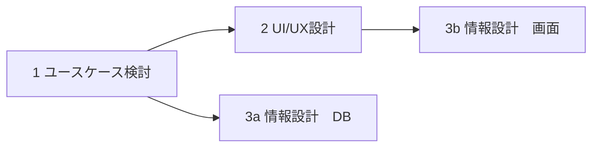

# （記述中）プロジェクトマネジメント
ソフトウェア開発において、やるべきことを俯瞰整理してみる。  
進め方の例は下記の通り。プロジェクトによって変わるはず。

各フェーズでは次のような成果物が得られることを想定。

| フェーズ | 項目               | 成果物                     |
| -------- | ------------------ | -------------------------- |
| 要件定義 |                    |                            |
|          | ユースケース       | ユースケース図             |
| 設計     |                    |                            |
|          |                    |                            |
|          |                    |                            |
|          |                    |                            |
|          | RDB設計            | ER図                       |
|          | テスト設計         | テスト項目書               |
| 実装     | マークアップ実装   | テンプレート、デザイン合意 |
|          | テスト実装         | テストコード               |
|          | バックエンド実装   | バックエンドコード         |
|          | フロントエンド実装 | フロントエンドコード       |
| テスト   | システムテスト     | テスト結果、カバレッジ     |
|          | 受け入れテスト     | リリース合意               |
| リリース | リリース計画       | 計画合意                   |
|          | リリース実施       | リリースされたシステム     |
| 保守     | バージョン管理     | バージョン管理表           |
|          | 脆弱性対応         | 対応計画                   |
|          | 不具合修正         | 修正計画                   |

戦略

要件

構造
ワイヤーフレーム
コンテンツマップ

骨格
コンポーネント

表層

ワイヤーフレーム
プロトタイプ
ユーザビリティ
PERT
CCPM
WBS
PMBOK

## 要件定義

## デザイン
### プロトタイプ

## 設計
### 情報設計
### コンポーネント設計

### RDB
ER図を作成してデータの関係性を明示化する。  
後工程で作成が必要になるDDLやORM schemaを記述してからER図を自動生成するアプローチでも良い。

### テスト設計

## 実装
### マークアップ
デザインに沿って実際に画面や画面遷移を作成するフェーズ。
デザインとの乖離がないか、レイアウト崩れはないかなど、デザイナと認識が取れると良い。

成果物：template部

### テストコード
成果物のスコープを定める上で重要

### フロントエンド実装

### バックエンド実装

## テスト
### カバレッジ測定
### システムテスト
### 運用テスト

## リリース
### リリース計画
### リリース実施

## 保守
### バージョン管理

### 脆弱性対応

### 不具合修正
不具合特定を正しく行うために、**再現性**を確認すること。

## 参考
- [フロントエンド開発の基本的な流れとは？フロー別に徹底解説](https://media.tricorn.co.jp/development/frontend/2275/#toc9)
- [画面設計とは](https://diveintocode.jp/blogs/Technology/depScreenLayout)

# アジャイル開発

# ガントチャート

## 参考
- [MVP（Minimum Viable Product）の意味を理解する。そして、なぜ私はEarliest Testable / Usable / Lovableを好むのか。](https://www.ankr.design/designtips/making-sense-of-mvp)