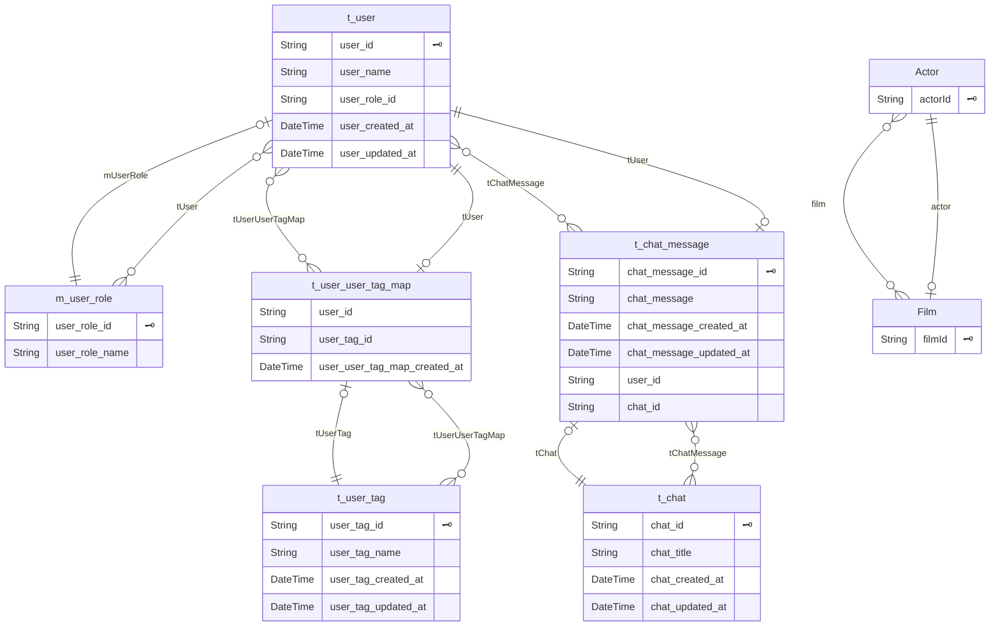

```mermaid
erDiagram

  "t_user" {
    String user_id "🗝️"
    String user_name 
    String user_role_id 
    DateTime user_created_at 
    DateTime user_updated_at 
    }
  

  "m_user_role" {
    String user_role_id "🗝️"
    String user_role_name 
    }
  

  "t_user_tag" {
    String user_tag_id "🗝️"
    String user_tag_name 
    DateTime user_tag_created_at 
    DateTime user_tag_updated_at 
    }
  

  "t_user_user_tag_map" {
    String user_id 
    String user_tag_id 
    DateTime user_user_tag_map_created_at 
    }
  

  "t_chat" {
    String chat_id "🗝️"
    String chat_title 
    DateTime chat_created_at 
    DateTime chat_updated_at 
    }
  

  "t_chat_message" {
    String chat_message_id "🗝️"
    String chat_message 
    DateTime chat_message_created_at 
    DateTime chat_message_updated_at 
    String user_id 
    String chat_id 
    }
  

  "Actor" {
    String actorId "🗝️"
    }
  

  "Film" {
    String filmId "🗝️"
    }
  
    "t_user" o|--|| "m_user_role" : "mUserRole"
    "t_user" o{--}o "t_user_user_tag_map" : "tUserUserTagMap"
    "t_user" o{--}o "t_chat_message" : "tChatMessage"
    "m_user_role" o{--}o "t_user" : "tUser"
    "t_user_tag" o{--}o "t_user_user_tag_map" : "tUserUserTagMap"
    "t_user_user_tag_map" o|--|| "t_user" : "tUser"
    "t_user_user_tag_map" o|--|| "t_user_tag" : "tUserTag"
    "t_chat" o{--}o "t_chat_message" : "tChatMessage"
    "t_chat_message" o|--|| "t_user" : "tUser"
    "t_chat_message" o|--|| "t_chat" : "tChat"
    "Actor" o{--}o "Film" : "film"
    "Film" o|--|| "Actor" : "actor"
```
