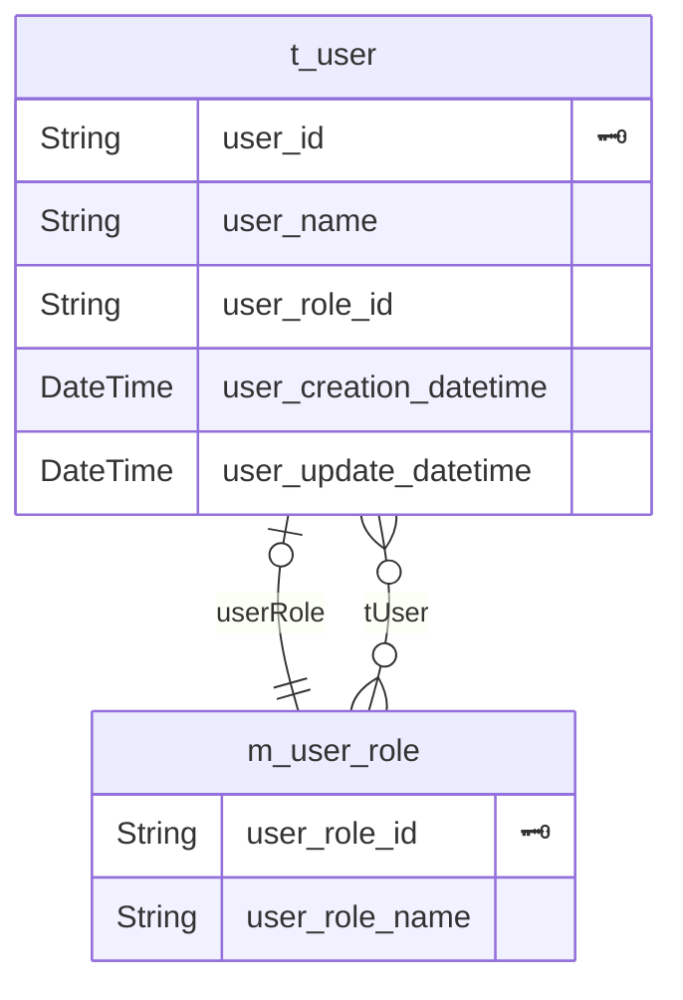

```mermaid
erDiagram

  "t_user" {
    String user_id "🗝️"
    String user_name
    String user_role_id
    DateTime user_creation_datetime
    DateTime user_update_datetime
    }


  "m_user_role" {
    String user_role_id "🗝️"
    String user_role_name
    }

    "t_user" o|--|| "m_user_role" : "userRole"
    "m_user_role" o{--}o "t_user" : "tUser"
```
