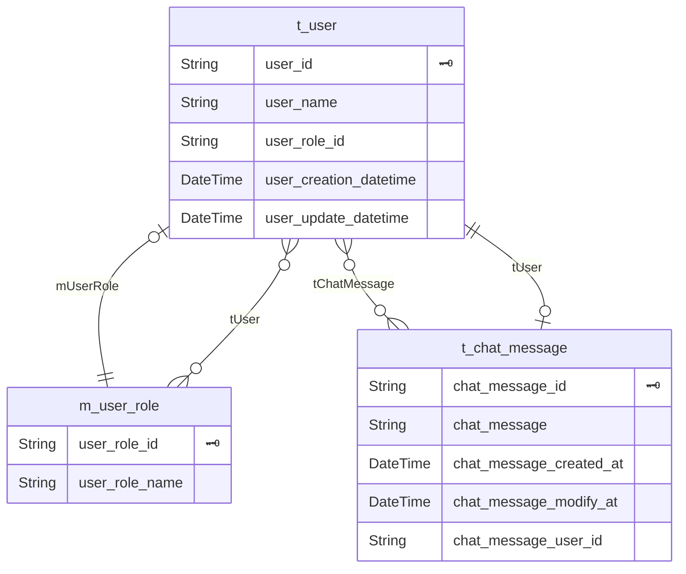

```mermaid
erDiagram

  "t_user" {
    String user_id "🗝️"
    String user_name 
    String user_role_id 
    DateTime user_creation_datetime 
    DateTime user_update_datetime 
    }
  

  "m_user_role" {
    String user_role_id "🗝️"
    String user_role_name 
    }
  

  "t_chat_message" {
    String chat_message_id "🗝️"
    String chat_message 
    DateTime chat_message_created_at 
    DateTime chat_message_modify_at 
    String chat_message_user_id 
    }
  
    "t_user" o|--|| "m_user_role" : "mUserRole"
    "t_user" o{--}o "t_chat_message" : "tChatMessage"
    "m_user_role" o{--}o "t_user" : "tUser"
    "t_chat_message" o|--|| "t_user" : "tUser"
```
