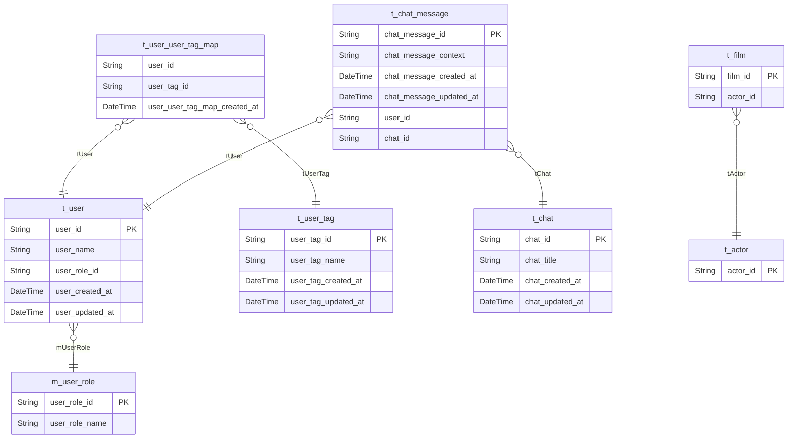

```mermaid
erDiagram

  t_user {
    String user_id PK 
    String user_name  
    String user_role_id  
    DateTime user_created_at  
    DateTime user_updated_at  
    }
  

  m_user_role {
    String user_role_id PK 
    String user_role_name  
    }
  

  t_user_tag {
    String user_tag_id PK 
    String user_tag_name  
    DateTime user_tag_created_at  
    DateTime user_tag_updated_at  
    }
  

  t_user_user_tag_map {
    String user_id  
    String user_tag_id  
    DateTime user_user_tag_map_created_at  
    }
  

  t_chat {
    String chat_id PK 
    String chat_title  
    DateTime chat_created_at  
    DateTime chat_updated_at  
    }
  

  t_chat_message {
    String chat_message_id PK 
    String chat_message_context  
    DateTime chat_message_created_at  
    DateTime chat_message_updated_at  
    String user_id  
    String chat_id  
    }
  

  t_actor {
    String actor_id PK 
    }
  

  t_film {
    String film_id PK 
    String actor_id  
    }
  
    t_user o{--|| m_user_role : "mUserRole"
    t_user_user_tag_map o{--|| t_user : "tUser"
    t_user_user_tag_map o{--|| t_user_tag : "tUserTag"
    t_chat_message o{--|| t_user : "tUser"
    t_chat_message o{--|| t_chat : "tChat"
    t_film o{--|| t_actor : "tActor"
```
